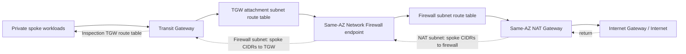

# Centralized egress path

```mermaid
flowchart LR
  S["Private spoke workloads"] --> T["Transit Gateway"]
  T --> A["TGW attachment subnet route table"]
  A --> F["Same-AZ Network Firewall endpoint"]
  F --> FR["Firewall subnet route table"]
  FR --> N["Same-AZ NAT Gateway"]
  N --> I["Internet Gateway / Internet"]

  I -. "return" .-> N
  N -. "NAT subnet: spoke CIDRs to firewall" .-> F
  F -. "Firewall subnet: spoke CIDRs to TGW" .-> T
  T -. "Inspection TGW route table" .-> S
```
